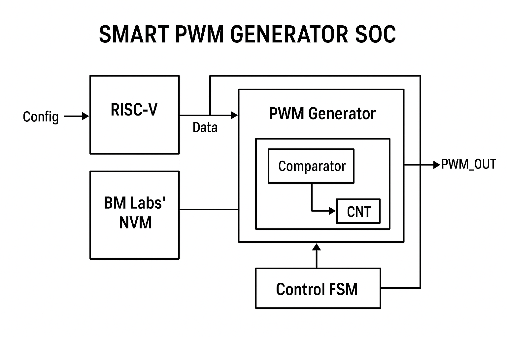

# 🧩 Smart PWM Generator SoC with ReRAM-Based Pattern Storage for Automotive Applications 

### **Author:** Hadjer Bouyahiaoui   
### **Project Name:** Smart PWM Generator SoC  
### **Target Platform:** ChipFoundry Caravel SoC (SKY130)  
### **Category:** Edge Computing / Automotive / Medical Applications  
### **License:** Apache 2.0  

---

## 🧠 Project Overview

**Smart PWM Generator SoC** is a system that integrates **Non-Volatile Memory (NVM)** for persistent PWM pattern storage and instant-on operation.  

This design demonstrates how embedded NVM can enhance system reliability and enable energy-efficient, intelligent control in **automotive**, **medical**, and **edge computing** environments.  

At power-up, the SoC automatically retrieves pre-stored PWM duty cycles or waveform patterns from **BM Labs’ ReRAM IP** and drives the outputs accordingly — without requiring external firmware reload or volatile configuration memory.

This approach significantly **reduces initialization time**, **saves power**, and provides **robust recovery** after unexpected resets or power losses.

The SoC can be reused in various control and modulation applications, such as:
- Motor control
- Power converters
- LED dimming
- Communication and modulation schemes

---

## ⚙️ System Architecture

The system consists of:
- **CPU / Configuration Interface:** Used during setup phase to load duty cycle patterns or modulation parameters into NVM.
- **NVM / Memory Block:** Stores duty cycles or modulation sequences.
- **PWM Generator:** Produces pulse-width-modulated outputs using counters and comparators.
- **Control FSM / Timing Unit:** Controls read/update timing between memory and PWM.

---

## 🔄 Operating Modes
1. **Configuration Mode:**  
   The CPU writes new duty cycles or pattern sequences into memory via bus interface.

2. **Autonomous Mode:**  
   The PWM generator reads stored data and produces continuous PWM output.

---

## 🧰 Simulation and Verification
- **Language:** VHDL 
- **Testbench:** Generates clock and simulates multiple duty cycle configurations
- **Waveform Analysis:** GTKWave 

